# IntelliJ IDEA Tutorial

## 1. Download IntelliJ IDEA Community Edition

IntelliJ IDEA Community Edition is an open-source version of IntelliJ IDEA, a premier IDE for Java, Scala and other JVM-based programming languages. [You can download it from the official website](https://www.jetbrains.com/idea/download).

## 2. Install the Scala plugin
After the installation, launch Intellij. You should see the welcome screen. Click on **plugins** and then search for "scala" in the list as illustrated bellow. Install the latest Scala (from JetBrains) plugin for Intellij.
**Note**: You can do the same from the opened IDE with **File** > **Settings** > **Plugins**.  

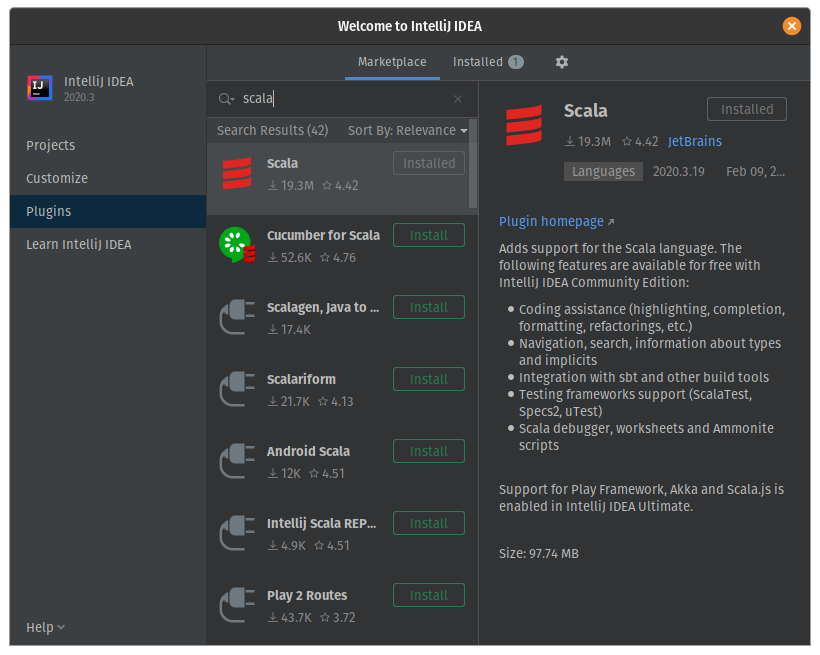

Note that Scala plugin requires restart to complete installation. Thus, **restart Intellij** before following the next steps.

## 3. Create a project
From the welcome screen: **Projects** > **New Project**. As illustrated bellow select **Scala** > **sbt**.

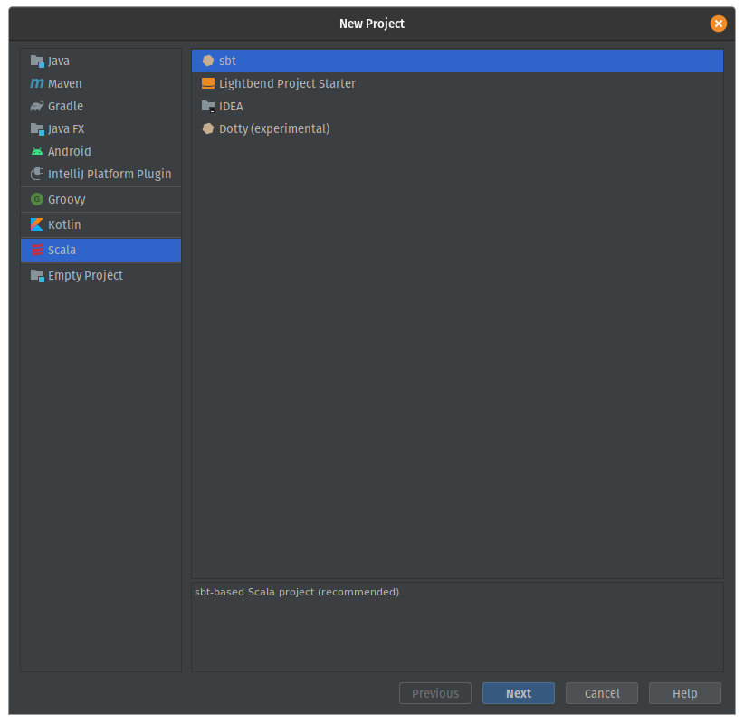

Now, rename the project and make sure that the selected JDK version is either 1.8 or 11. Moreover, check that the Scala version is 2.13.x and that the sbt version used is higher than 1.x.x. If you don't see the targeted version, please make sure that you have followed the [tools setup](https://www.coursera.org/learn/progfun1/supplement/BNOBK/tools-setup-please-read). After that click **finish** and wait for SBT being done processing.

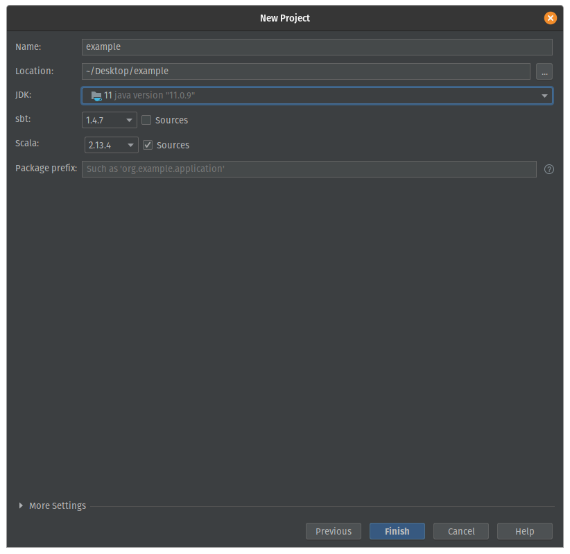

**Note**: You can always change the JDK version in IntelliJ by going to **File** > **Project Structure** > **Project**. And then you can select the desired JDK under **Project SDK**.
 
**Note**: The first time we create or import a SBT project, IntelliJ may not show the structure of the project right away. This happens because IntelliJ decides to delay this task until it has successfully executed sbt and downloaded all the required dependencies. Once that's done, the usual `src` folder and their subfolders will be created.

## 4. Creating a Scala worksheet
Right click on the "scala" folder as illustrated bellow. Then, go to **New** > **Scala Worksheet**.

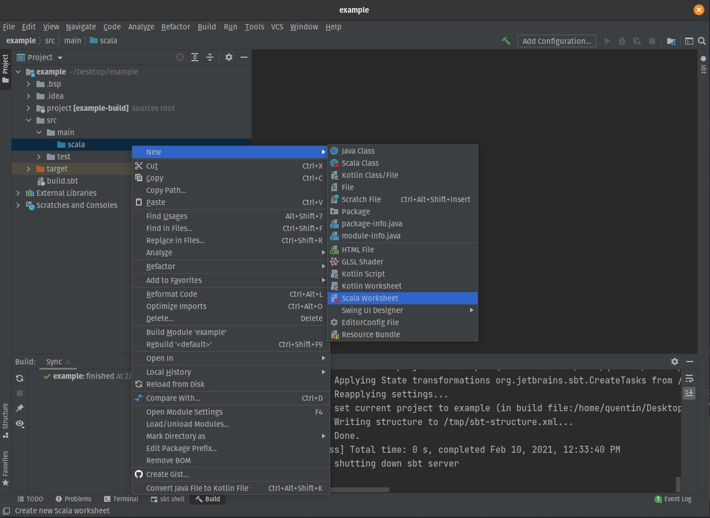

Note: If **Scala Worksheet** is missing, right click on the root folder of the project (here **example**) and choose **Add Framework Support...**. Then select **Scala**.

In order to evaluate the newly created Worksheet, click on the green arrow in the top left corner of the Worksheet tab. You should observe the following :

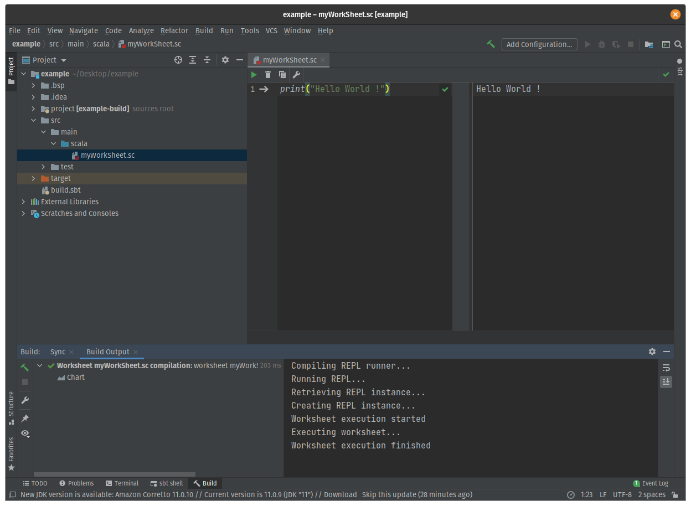

**Tip** : Scala worksheets are a great tool to familiarize yourself with the language and its features. Fill free to use them during the course when you want to test your understanding of the material.  

## 5. Creating a Scala program

In the same way as the worksheet, right click on the "scala" folder and go to **New** > **Scala Class**.

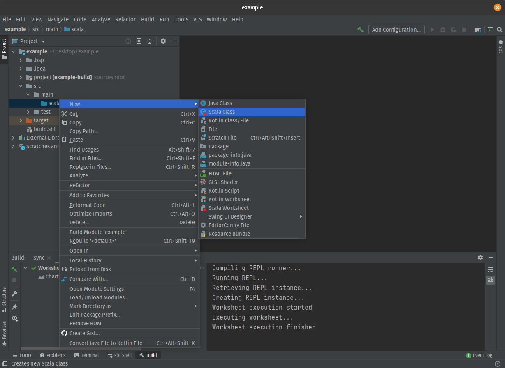

In the little menu popping up, select "object" as followed.

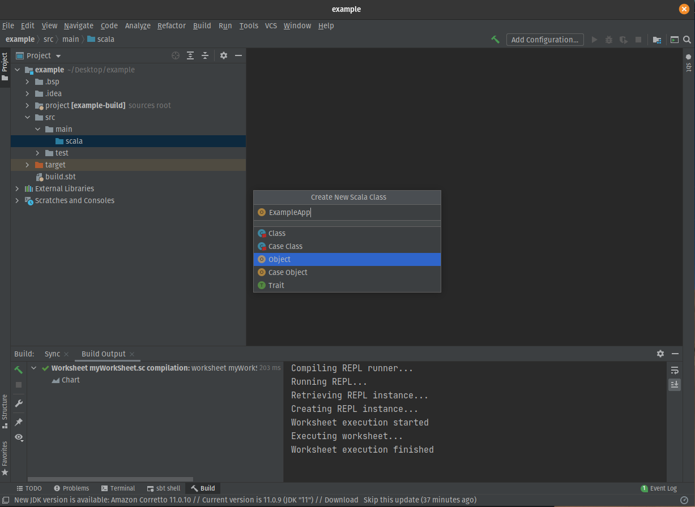

Then, modify the object in the same way as in the picture bellow.

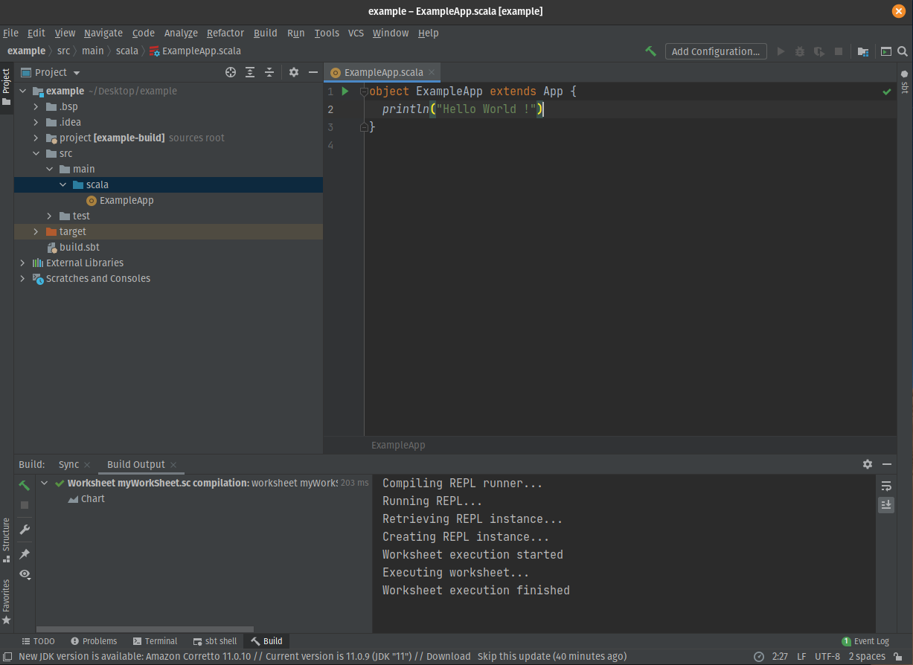

You can the run the program by clicking on the green arrow in the code tab or by clicking the green arrow in the top right part the of window.
Once the program is run the following output should be visible in the console :

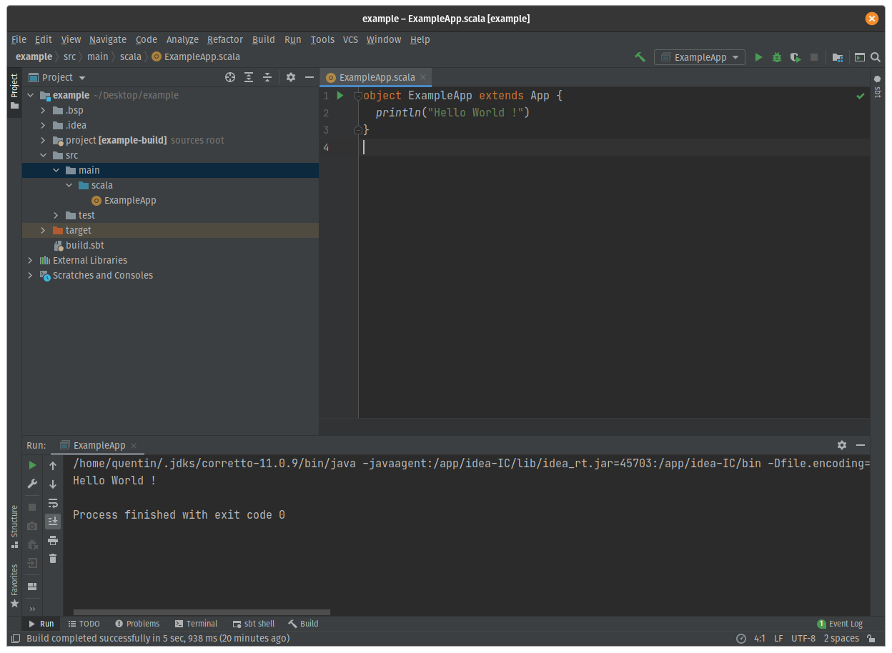

## 6. Opening an SBT project
All the handout files (assignments of this course) are SBT projects. If you want to hack on them using IntelliJ, you need to import the project first.

* From the welcome screen
Go to **Projects** > **Open**. Then find the project you want to open and click on the root folder of the project (the one containing the build.sbt file as direct child). Finally, click **OK** and the project should open in IntelliJ. 

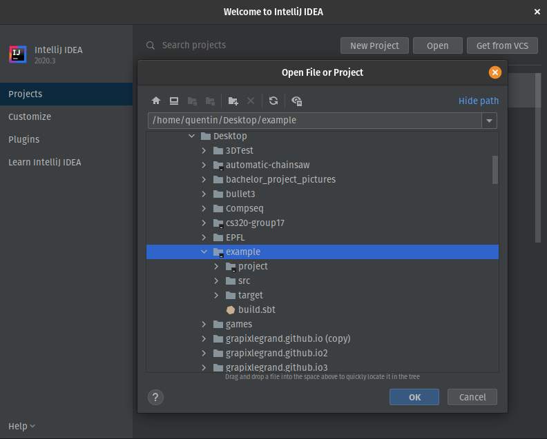

* From Intellij
Go to **File** > **Open**. From here it is the same as from the welcome screen.

## 7. Synchronizing SBT and IntelliJ IDEA projects

IntelliJ  IDEA SBT support synchronizes the project with your build file, so when you change Scala version you're going to use, or add a library, your project is updated accordingly. For the next time, you can avoid this step by checking off the option "Use auto-import" in Step 6.

You can find bellow how to modify the dependencies of your project by clicking on the build.sbt file from the project.

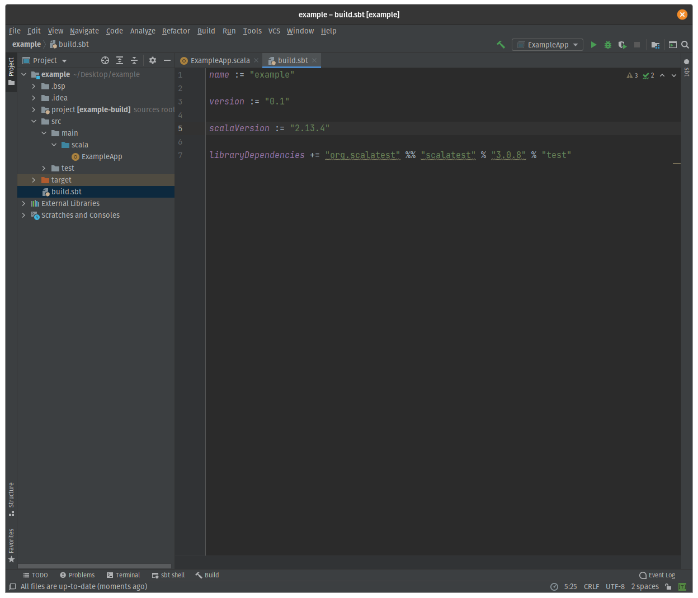

The double percentage symbol will force sbt to use the current scala version defined in scalaVersion (which has to be "2.13.x").

**Note**: Once you've changed the build.sbt file you need to reload the build. Usually, a very small icon will appear in the right top corner of the code tab. Click on it to reload the SBT changes.

## 8. Using terminal to run SBT commands

To use the SBT command line from within IntelliJ, simply click on **sbt shell** in the bottom of the dialog box as shown bellow.

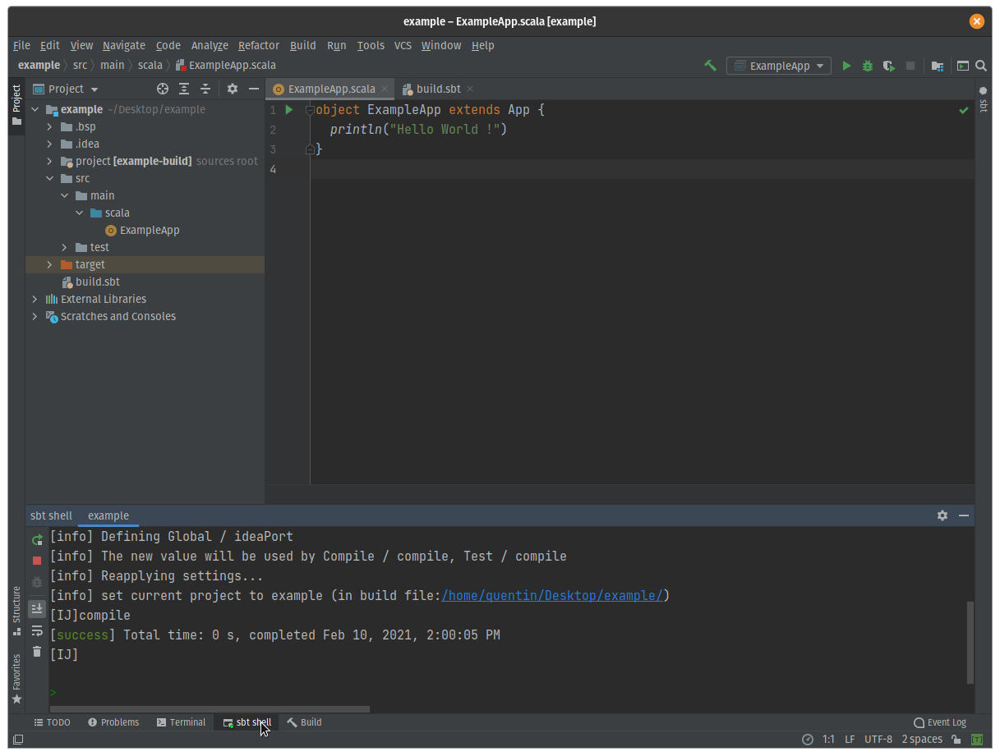

By typing "compile" in the terminal you should see a green message saying "success".

## 9. More information and troubleshooting

To learn more about IntelliJ IDEA, read the IntelliJ IDEA official [documentation](https://www.jetbrains.com/fr-fr/idea/resources/).
